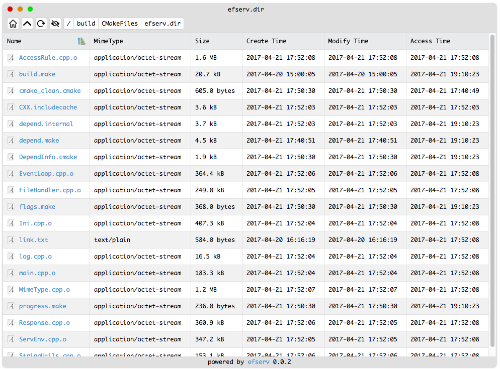

# efserv

[[中文文档](README_CN.md)] [[English README](README.md)]

* author: xiaozhuai

* email: 798047000@qq.com

efserv is an Event-driven asynchronous http static file server written in C++，high performance，and low memory. Full name is EzFileServer.

# Dependencies
* [libev](http://software.schmorp.de/pkg/libev.html) (not included in project)
* [http_parser](https://github.com/nodejs/http-parser) (included)
* [tinyformat](https://github.com/c42f/tinyformat) (included)

Before you can build, you need install libev.

For linux (debian like):

```
$ sudo apt-get install libev-dev
```

For linux (redhat like):

Sorry, I do not try it, find out yourself.

For OSX:

You need brew. (A package manager for osx)

```
$ brew install libev
```

# Build

efserv use cmake for building. 

Follow these steps:

``` bash
$ cd /path/to/efserv
$ mkdir build
$ cd build
$ cmake ..
$ make
$ make install
```

These things will be installed:
```
-- Installing: /usr/local/bin/efserv
-- Installing: /usr/local/efserv/tpl
-- Installing: /usr/local/efserv/tpl/dir_indexs.html
-- Installing: /usr/local/efserv/tpl/err.html
-- Installing: /usr/local/efserv/README.md
-- Installing: /usr/local/efserv/README_CN.md
-- Installing: /usr/local/efserv/LICENSE.md
-- Installing: /usr/local/efserv/.efserv_access
-- Installing: /usr/local/efserv/config.ini
```

* `/usr/local/bin/efserv` is the program binary
* `/usr/local/efserv/tpl` are the tpls used when err occured or dir indexs
* `/usr/local/efserv/.efserv_access` is a demo of access rules config
* `/usr/local/efserv/config.ini` is a demo of server config


# Run

Just exec command `efserv`.
`/var/www` will be the default web root directory.

Yes, you can change it, just typing `efserv --help` to get help.

```
EzFileServer
Author : xiaozhuai
Email  : 798047000@qq.com
Usage  : efserv [OPTION]...

All arguments are long options
  --config <file>           Define the ini config path, it will be ".efserv_config" under web root by default
  --root <dir>              Define the web root path, it will be "/var/www" by default
  --log-level <level>       Define the log level, available levels are : disable, error, warning, info, debug
  --help                    Print this help message
```

# Options

Use `--root` option to define the web root.

And you can define a config file on command line provide `--config` option with params.

If you do not provided the `--config` option, efserv will find config file in web root which named `.efserv_config`. If not exist, it will use its default values.

efserv has 5 log-level, and you can define it before runing use `--log-level` option.

# Config

Let's find out what are there in config file.

Take a look at `/usr/local/efserv/config.ini`(this is just a demo file).

```
# EzFileServer project
# author: xiaozhuai
# email: 798047000@qq.com

#define the listening addr, use 0.0.0.0 by default
listen = 0.0.0.0

# define the listening port, use 80 by default
port = 8080

# whether enable dir indexs, is enabled by default, 0 disable, 1 enable
# if disable, all request to dir will be denied (403)
dir_indexs = 1

# define the view tpl of dir indexs, use "/usr/local/efserv/tpl/dir_indexs.html" by default
# dir_indexs_tpl = /usr/local/efserv/tpl/dir_indexs.html
dir_indexs_tpl = tpl/dir_indexs.html

# define the err page tpl, use "/use/local/efserv/tpl/err.html" by default
# err_tpl = /use/local/efserv/tpl/err.html
err_tpl = tpl/err.html

# define the access rule file name, use ".efserv_access" by default. This file should be under the root of web server
# .efserv_access should be like this
# - ^/private/.*$
# + ^/private/resources/.*$
# all request start with "/private/" will be denied, except the request start with "/private/resources/"
# warning!
# if change it to
# + ^/private/resources/.*$
# - ^/private/.*$
# things will be different, all request start with "/private/" will be denied
# the rule are matched from up to bottom, the last rule will be effective
# if nothing is private, just remove this file or let it empty
# by default, ".efserv_access" itself and ".efserv_config" in web root is denied, you can allow it by add line "+ .efserv_access" and "+ .efserv_config"
# access_rule = .efserv_access
```

# Access Rule

In config file, we see an option named `access_rule`, this file contains access rule, by regex matching.

This file is under web root directory named `.efserv_access` by default, you can change its name in config file, but you should always put it under web root directory.

Look at `/usr/local/efserv/.efserv_access`

```
# Denied private
- /private # in-line comment
+ /test
+ /demo
```

`+` meaning allow while `-` mening denied.

And regex pattern is fine, for example

```
+ ^/private/resources/.*$
- ^/private/.*$
```

# Images




