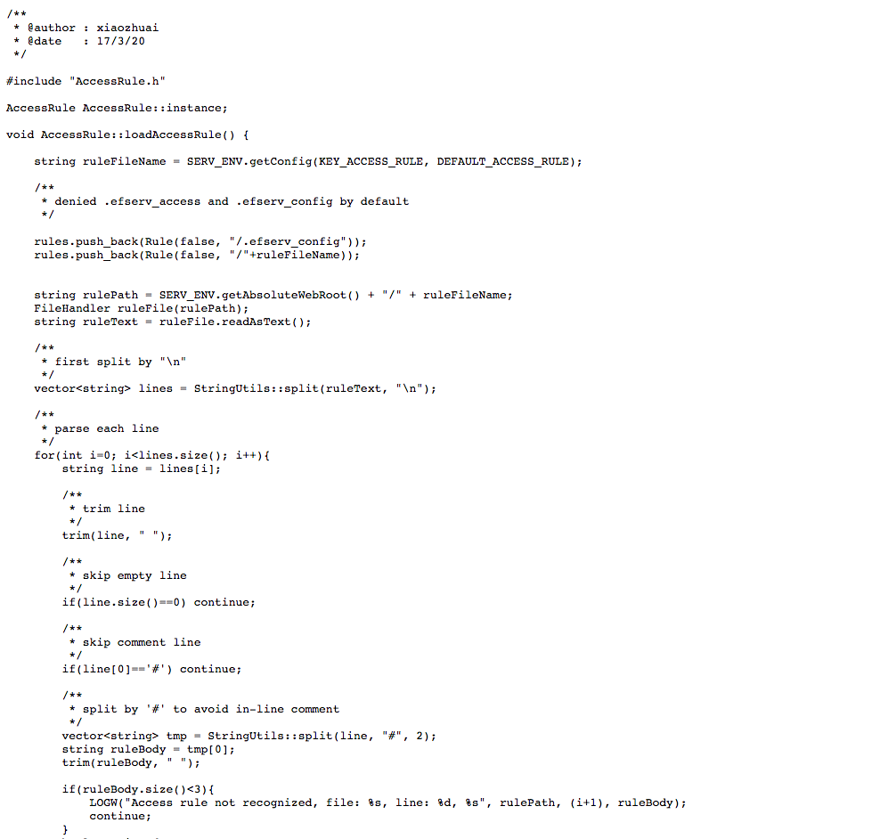
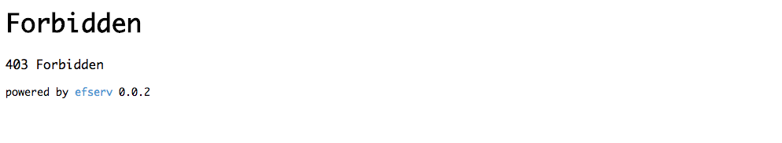

# efserv

[[中文文档](README_CN.md)] [[English README](README.md)]

* author: xiaozhuai

* email: 798047000@qq.com

efserv 是一个事件驱动异步模型的http静态文件服务器，使用C++编写。具有高性能，低内存的有点。全名为 EzFileServer。

# 依赖
* [libev](http://software.schmorp.de/pkg/libev.html) (未包含在项目中)
* [http_parser](https://github.com/nodejs/http-parser) (已包含在项目中)
* [tinyformat](https://github.com/c42f/tinyformat) (已包含在项目中)

在构建项目之前，你需要安装 libev

Debian 系列 linux：

```
$ sudo apt-get install libev-dev
```

Redhat 系统 linux：

我没有尝试，你可以自己google一下。

For OSX:

你需要安装brew。（一个osx平台的包管理软件）

```
$ brew install libev
```

# 构建

efserv 使用 cmake 来构建项目。

参考下面的步骤

``` bash
$ cd /path/to/efserv
$ mkdir build
$ cd build
$ cmake ..
$ make
$ make install
```

将会安装这些文件：
```
-- Installing: /usr/local/bin/efserv
-- Installing: /usr/local/efserv/tpl
-- Installing: /usr/local/efserv/tpl/dir_indexs.html
-- Installing: /usr/local/efserv/tpl/err.html
-- Installing: /usr/local/efserv/README.md
-- Installing: /usr/local/efserv/README_CN.md
-- Installing: /usr/local/efserv/LICENSE.md
-- Installing: /usr/local/efserv/.efserv_access
-- Installing: /usr/local/efserv/config.ini
```

* `/usr/local/bin/efserv` 二进制可执行文件
* `/usr/local/efserv/tpl` efserv使用的视图模板文件
* `/usr/local/efserv/.efserv_access` 一个访问控制配置的demo文件
* `/usr/local/efserv/config.ini` 一个服务配置的demo文件


# 运行

至今执行命令 `efserv` 就可以了。
`/var/www` 将会是默认的web根目录。

你可以更改这些选项，执行 `efserv --help` 来获取帮助。

```
EzFileServer
Author : xiaozhuai
Email  : 798047000@qq.com
Usage  : efserv [OPTION]...

All arguments are long options
  --config <file>           Define the ini config path, it will be ".efserv_config" under web root by default
  --root <dir>              Define the web root path, it will be "/var/www" by default
  --log-level <level>       Define the log level, available levels are : disable, error, warning, info, debug
  --help                    Print this help message
```

# 选项

使用 `--root` 选项来定义web根目录

使用 `--config` 选项来定义服务配置文件的路径。

如果你运行时没有提供 `--config` 选项, efserv 将会在web根目录下寻找名为 `.efserv_config` 的文件作为配置文件. 如果不存在这个文件，将会使用内置的默认值。

efserv 有5个日志等级， 你可以通过 `--log-level` 选项来调节。

# 配置

让我们来看一下配置文件里都有些什么。

查看 `/usr/local/efserv/config.ini` (这只是一个demo)

文件里已经包含详细的说明。

```
# EzFileServer project
# author: xiaozhuai
# email: 798047000@qq.com

#define the listening addr, use 0.0.0.0 by default
listen = 0.0.0.0

# define the listening port, use 80 by default
port = 8080

# whether enable dir indexs, is enabled by default, 0 disable, 1 enable
# if disable, all request to dir will be denied (403)
dir_indexs = 1

# define the view tpl of dir indexs, use "/usr/local/efserv/tpl/dir_indexs.html" by default
# dir_indexs_tpl = /usr/local/efserv/tpl/dir_indexs.html
dir_indexs_tpl = tpl/dir_indexs.html

# define the err page tpl, use "/use/local/efserv/tpl/err.html" by default
# err_tpl = /use/local/efserv/tpl/err.html
err_tpl = tpl/err.html

# define the access rule file name, use ".efserv_access" by default. This file should be under the root of web server
# .efserv_access should be like this
# - ^/private/.*$
# + ^/private/resources/.*$
# all request start with "/private/" will be denied, except the request start with "/private/resources/"
# warning!
# if change it to
# + ^/private/resources/.*$
# - ^/private/.*$
# things will be different, all request start with "/private/" will be denied
# the rule are matched from up to bottom, the last rule will be effective
# if nothing is private, just remove this file or let it empty
# by default, ".efserv_access" itself and "config.ini" in web root is denied, you can allow it by add line "+ .efserv_access" and "+ config.ini"
# access_rule = .efserv_access
```

# 访问控制

在配置文件中，我们发现一个配置项为 `access_rule`，这个文件包含了访问控制的规则，匹配规则使用正则匹配。

默认情况下，访问控制文件位于web根目录下，名为 `.efserv_access` ，你可以在配置文件中修改默认的文件名, 但是你必须把它放到web根目录下。

查看 `/usr/local/efserv/.efserv_access`

```
# Denied private
- /private # in-line comment
+ /test
+ /demo
```

`+` 意为允许
`-` 意为禁止

使用正则，例如

```
+ ^/private/resources/.*$
- ^/private/.*$
```

# 图片






